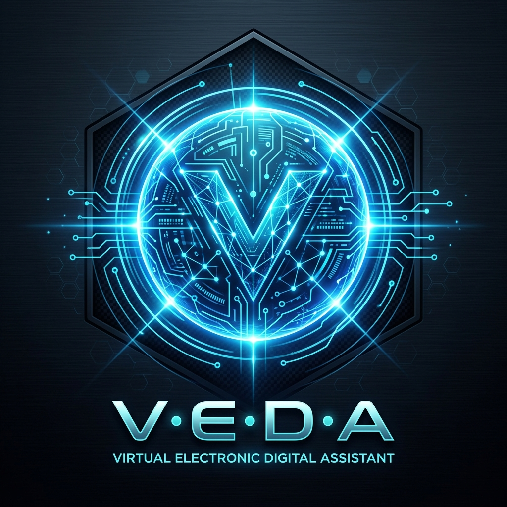
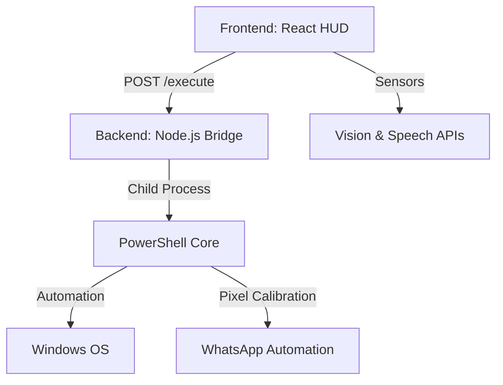

<div align="center">
  
  <h1>V.E.D.A — Visual-Electronic Digital Assistant</h1>
  <p><i>The Future of Desktop Intelligence and System Automation</i></p>

  [](https://reactjs.org/)
  [](https://nodejs.org/)
  [](https://expressjs.com/)
  [](https://microsoft.com/powershell)
  <br>
  [](#)
  [](#)
</div>

---

## 🌌 Overview

**V.E.D.A** is a cutting-edge **Intelligent Control System** designed to bridge the gap between user intent and system action. Combining a futuristic **Vision HUD** with a specialized **System Control Bridge**, V.E.D.A allows you to control your PC using voice, vision, and advanced terminal commands.

Whether it's opening complex applications, automating WhatsApp messaging, or performing surgical system audits, V.E.D.A handles it all through a sleek, minimal interface.

## 🚀 Key Features

- **🛡️ System Control Bridge**: A specialized backend that executes OS-level commands via PowerShell with surgical precision.
- **👁️ Vision HUD**: Real-time visual feedback and system status monitoring.
- **🗣️ Dynamic Voice Recognition**: Integrated speech-to-intent engine for hands-free operations.
- **📱 WhatsApp Automation**: Fully automated messaging and calling protocols (powered by calibrated pixel offsets).
- **📟 Advanced Terminal**: A low-latency command interface for power users.
- **☁️ Real-time Synchronization**: Weather, time, and system health monitoring built-in.

## 🏗️ Architecture



## 🛠️ Tech Stack

- **Frontend**: React.js, Custom Hooks, CSS3 (Futuristic HUD Design)
- **Backend**: Node.js, Express.js
- **Automation**: PowerShell (Advanced Scripting)
- **Integrations**: WScript.Shell, System.Windows.Forms

## 🚦 Getting Started

### Prerequisites
- Node.js (v14+)
- Windows OS (Required for PowerShell automation)

### Installation

1. **Clone the repository**
   ```bash
   git clone https://github.com/jaygupta-exe/veda-intelligent-control-system.git
   cd veda-intelligent-control-system
   ```

2. **Setup Backend**
   ```bash
   cd backend
   npm install
   node server.js
   ```

3. **Setup Frontend**
   ```bash
   cd ../frontend
   npm install
   npm start
   ```

## 👨‍💻 Developed By
**Jay Gupta** - [GitHub Profile](https://github.com/jaygupta-exe)

---

<p align="center"><i>"Building the interface of tomorrow, one command at a time."</i></p>
